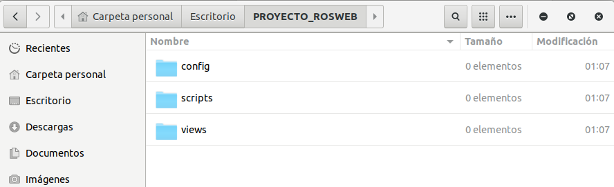
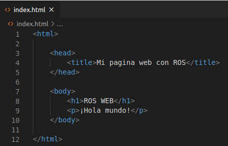
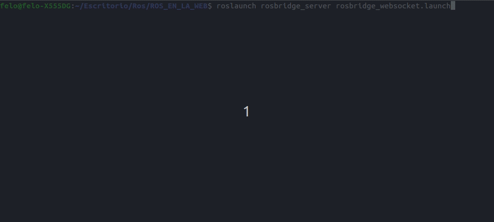
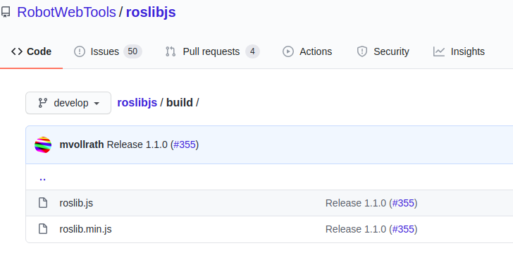
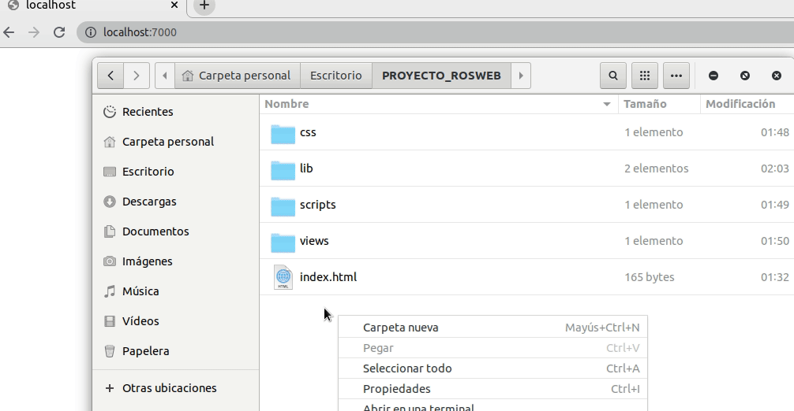

<p align='center'>
    
</p>

# INTRODUCCIÓN
En el siguiente topico vamos a realizar las configuraciones que debemos tener antes de comenzar a comunicar a ROS con una pagina web. 

# MENÚ

- [**1. Creado nuestra pagina**](#1-creando-nuestra-pagina)
- [**2. Descargar e instalar rosbridge server**](#2-descargando-rosbridge-server)
- [**3. Descargando roslibjs**](#3-descargando-roslibjs)
- [**4. Python - SimpleHttpServer**](#4-python---simplehttpserver)

# 1. Creando nuestra pagina
Nuestra primera configuración será crear una carpeta en donde guardaremos todo lo relacionado nuestra pagina web. Para ello nos ubicamos donde queremos guardar el proyecto y seguidamente crearemos la siguiente jerarquia de carpetas:

<p align='center'>
    
    <p align='center'>Imagen 1. Creación de carpetas necesarias para el proyecto</p>
</p>

La principal funcionalidad de cada carpeta es separar por capas nuestro codigo, de esta manera vamos a ser mucho más ordenados y podremos encontrar nuestros archivos facilmente. Ahora vamos a explicar que debe ir en cada carpeta que se ve en la imagen 1:

 - CSS: Van los archivos de Cascading Style Sheets, son estos archivos los que nos permitiran darle colores y forma a nuestra pagina.
 - LIB: En la carpeta lib guardaremos todo lo relacionado a librerias y/o dependencias del proyecto
 - SCRIPTS: En scripts guardaremos todos nuestros scripts propios, por ejemplo; conexiones, talker's, listener's
 - VIEWS: En views guardaremos todo lo relacionado a vistas de nuestros proyectos, por ejemplo; archivos html, php... etc.

Una vez creado todas las carpetas, procedemos a editar el archivo index.html (si no lo ha creado, creelo). Lo unico que haremos será crear la estructura base de HTML que nos ayudará para comezar. El archivo deberá quedar algo así:

<p align='center'>
    
    <p align='center'>Imagen 2. Código del archivo index.html</p>
</p>


# 2. Descargando rosbridge server
Para la descarga de rosbridge solo será necesario una instrucción en nuestra consola de comandos siempre y cuando cumplamos con los requisitos del tutorial que se encuentran en el readme de la carpeta raiz de este mismo repositorio. Para instalar rosbridge ejecutamos:

    sudo apt-get install ros-<rosdistro>-rosbridge-server
**NOTA:** Se debe remplazar \<rosdistro\> por nuestra distribución de ROS, en nuestra caso trabajaremos con melodic, por lo tanto nuestro comando queda de la siguiente forma:
    
    sudo apt-get install ros-melodic-rosbridge-server
    
para verificar que toda la instalación se encuentre correctamente ejecutaremos el siguiente comando:

    roslaunch rosbridge_server rosbridge_websocket.launch

Si todo ha salido bien, la salida debería ser algo como esto:

<p align='center'>
    
    <p align='center'>Imagen 3. Ejecutando Rosbridge Server</p>
</p>

**Nota**: No es necesario tener el roscore en ejecución, ya que el comando ejecuta un nuevo roscore.

# 3. Descargando roslibjs
Para descargar roslibjs, existen dos formas de hacerlo. Mediante una etiqueta \<script\> en nuestra pagina web usando los repositorios oficiales de **robotwebtools.org** de manera remota o por el contrario, podemos descargar todo el repositorio oficial que se encuentra en su [github oficial](http://github.com/RobotWebTools/roslibjs). 

Nota: Debes pensar bien cual metodo utilizar, ya que por ejemplo, si queremos configurar un robot que no se encuentra conectado a internet, la primera opción **no** nos sirve, si por el contrario el robot sí tiene acceso a internet, podemos evitar descargar todo el paquete de roslibjs. (Esto tambien depende de donde estes ejecutando el servicio de rosbridge server).

**Repositorio Remoto (Opción 1)**

Si hemos optado por la primera opción, solo tendremos que agregar la siguiente etiqueta en cada pagina de nuestra aplicación web:
```
<head>
	<script type="text/javascript" src="https://static.robotwebtools.org/roslibjs/current/roslib.min.js">
	</script>
</head>
```
Esto nos permite acceder a los servidores de robotwebtools y agregar el repositorio de manera remota. De esta manera no tendremos que tener las librerias descargadas, aunque debemos tener en cuenta que las librerias se actualizarán solas, y puede haber casos en que el codigo que creemos quede inservible.

**Repositorio Local (Opción 2)**

Si finalmente hemos decidido que nuestro robot (o donde se encuentre nuestro rosbridge server) **no dispodrá de acceso a internet**, entonces deberemos descargar la librería necesaria, iremos al [github oficial de RobotWebTools](http://github.com/RobotWebTools/roslibjs), y allí descargaremos los dos archivos y los pondremos en nuestra carpeta lib de nuestro proyecto.

<p align='center'>
    
    <p align='center'>Imagen 4. Librerias JS del repositorio de RobotWebTools</p>
</p>

# 4. Python - SimpleHTTPServer

El módulo SimpleHTTPServer que viene con Python es un servidor HTTP simple que proporciona controladores de solicitud GET y HEAD estándar. Una ventaja del servidor HTTP integrado es que no es necesario instalar ni configurar nada, lo único que se necesita es tener Python instalado. De esta manera, vamos poder publicar nuestra pagina web. Lo siguiente que haremos es abrir una terminal en nuestra carpeta raiz y vamos a ejecutar el siguiente comando:

	python -m SimpleHTTPServer 7000;
	
Finalmente, podemos observar como se abre nuestra pagina web en la dirección: localhost:7000

<p align='center'>
    
    <p align='center'>Imagen 5. Demostración de SimpleHTTPServer</p>
</p>

