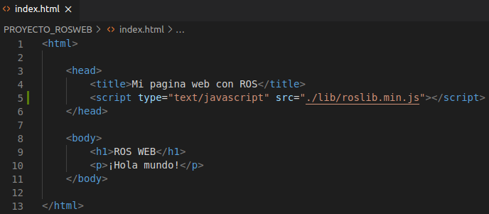
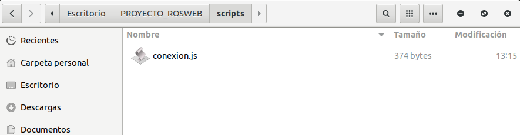
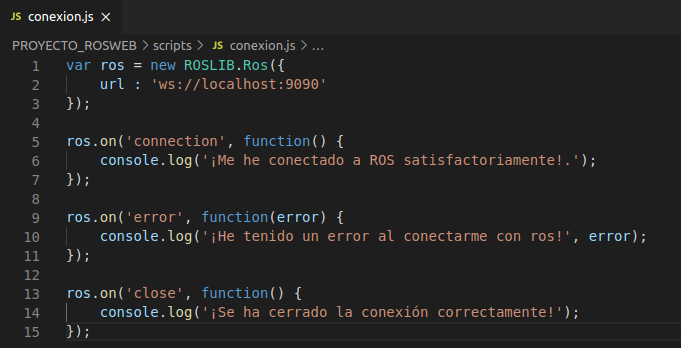

    

# INTRODUCCIÓN
En el siguiente topico vamos a realizar un script de conexión, quien será el que nos permita enviar y recibir información del rosbridge server. Para ello vamos a importar primero las libreras que previamente descargamos en la sección de ["descargando librerías"](../2.%20CONFIGURACIONES%20INICIALES#3-descargando-roslibjs). Seguidamente crearemos un script conexión que nos ayudará a conectar con ROS y finalmente haremos las pruebas pertinentes para verificar que existe una conexión.

# Menú
 - [**1. Importando Librerias**](#1-importando-librerias)
 - [**2. Script de conexión**](#2-script-de-conexión)
 - [**3. Pruebas de conexión**](#3-pruebas-de-conexión)

# 1. Importando Librerias
Para comenzar, aprenderemos a importar la librería de roslibjs, para ello iremos a nuestro archivo index.html de nuestra carpeta raíz del proyecto y dentro de las etiquetas \<head\> \</head\> añadiremos la ubicación de nuestras librerías con el siguiente codigo.

    

Recordemos que en nuestro caso, hemos descargado las librerías correspondientes en la carpeta lib de nuestro proyecto. Finalmente nuestro index.html, quedaría de esta manera:

    
    
Imagen 1. Importando librería roslibjs a nuestro index.html

Ahora que hemos importado nuestra librería en nuestro archivo html, podremos hacer uso de ella. Cabe destacar, que debemos importar la librería en todas las vistas que hagamos.

# 2. Script de conexión
Una vez que hemos importado las librerías necesarias, vamos a crear nuestro primer script llamado conexión, para ello crearemos en nuestra carpeta scripts un archivo llamado conexion.js quien será el encargado de conectarnos con ROS:

    
    
Imagen 2. Creando archivo script en la carpeta ./scripts 

Abriremos el script conexion.js y pondremos el siguiente codigo:

    var ros = new ROSLIB.Ros({
        url : 'ws://localhost:9090'
    });

Aquí hay que tener en cuenta que la url es la dirección donde se nos abre nuestro rosbridge server (generalmente se ejecuta en localhost:9090), pero en caso de no saber cual es la url de nuestro rosbridge server solo basta con lanzarlo con el siguiente comando:

    roslaunch rosbridge_server rosbridge_websocket.launch

Una vez abierto, buscaremos una linea algo parecida a esto:

    [INFO] [1600712697.838912]: Rosbridge WebSocket server started at ws://0.0.0.0:9090

la dirección ws://0.0.0.0:9090 hace alución a donde se está ejecutando nuestro Rosbridge, está será la que pongamos en el script.

Debajo del codigo anterior, vamos a poner las siguientes funciones que nos permitiran saber si hay algun error en la conexión o si por el contrario funcionó todo correctamente:

    ros.on('connection', function() {
        console.log('¡Me he conectado a ROS satisfactoriamente!.');
    });

    ros.on('error', function(error) {
        console.log('¡He tenido un error al conectarme con ros!', error);
    });

    ros.on('close', function() {
        console.log('¡Se ha cerrado la conexión correctamente!');
    });
    
Nuestro script conexion.js, finalmente tendrá el siguiente aspecto:

    
    
Imagen 3. Archivo de conexión escrito en JS 

Ahora que hemos creado nuestro archivo de conexión, debemos testear que sí este funcionando correctamente, para ello iremos nuevamente a nuestro archivo index.html de nuestra carpeta raiz del proyecto, y allí vamos a importar nuestro script debajo de donde importamos las librerías roslibjs, quedando nuestro head de esta manera:

    <head>
        <title>Mi pagina web con ROS</title>
        
        
    </head>

Una vez que hemos realizado todos los pasos correctamente, solo nos falta testear que todo funcione.

# 3. Pruebas de conexión
