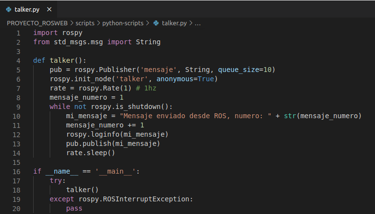
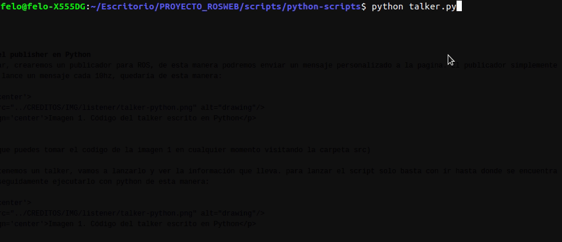
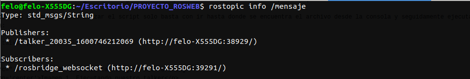
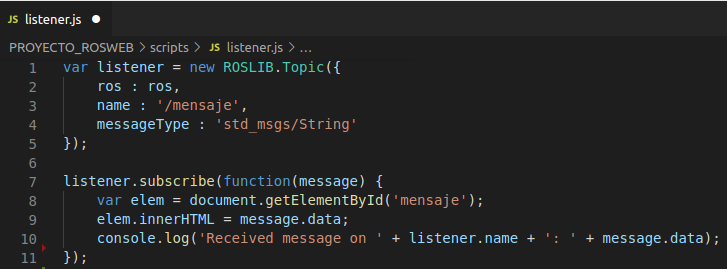
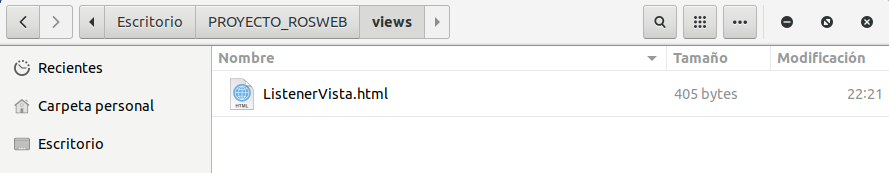
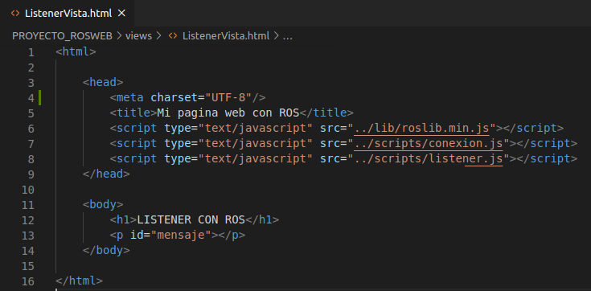
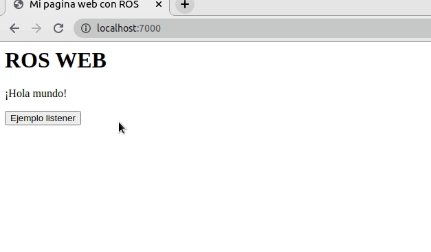
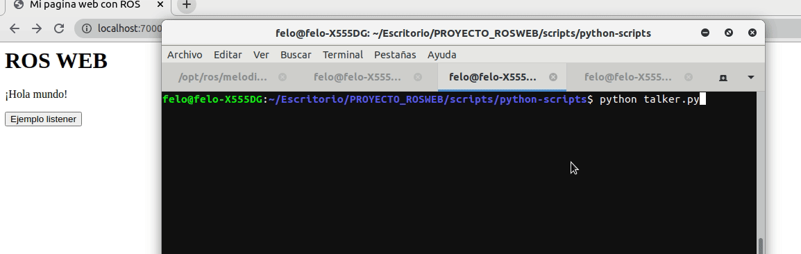

    

# INTRODUCCIÓN
En el siguiente topico realizaremos nuestro primer listener, de esta manera podremos leer los datos que se encuentran en nuestro ROS y mostrarlos en la pagina web. Para realizar la practica del Listener, haremos un publisher en Python que lance un mensaje cada cierto tiempo, luego desde nuestra pagina web nos suscribiremos al publisher y finalmente lo mostraremos en la pagina web.

# REQUISITOS PREVIOS
 - [] Tener inicializando nuestro rosbridge server
 - [] Tener inicializada nuestra pagina con SimpleHttpServer

# MENÚ
 - [**Creando publisher en Python**](#creando-el-publisher-en-python)
 - [**Creando script listener**](#creando-script-listener)
 - [**Modificando vistas**](#modificando-nuestras-vistas)
 - [**Probando nuestro listener**](#probando-el-listener)

# Creando el publisher en Python
Para empezar, crearemos un publicador para ROS, de esta manera podremos enviar un mensaje personalizado a la pagina. El publicador simplemente será un script en Python que lance un mensaje cada 10hz, quedaría de esta manera:

    
    
Imagen 1. Código del talker escrito en Python

(Recuerda que puedes tomar el codigo de la imagen 1 en cualquier momento visitando la carpeta src)

Ahora que tenemos un talker, para lanzar el script solo basta con ir hasta donde se encuentra el archivo desde la consola y seguidamente ejecutarlo con python de esta manera:

    python talker.py

    
    
Imagen 2. Ejecutando nuestro talker

¡Muy bien! Ahora estamos publicando un nuevo nodo en nuestro ROS llamado "mensaje". Para ver la información que lleva nuestro nodo vamos a usar el siguiente comando:

    rostopic info /mensaje

    
    
Imagen 3. Información que contiene el nodo mensaje

Como podemos ver, nos lanza el tipo de mensaje: std_msgs/String, esto será muy importante a la hora de construir nuestro listener desde roslibjs, ya que nos permitirá saber que vamos a recibir. 

Ahora que tenemos el talker personalizado, vamos a realizar nuestro listener en roslibjs.

# Creando script listener
Ahora que tenemos un publicador, vamos a recibirlo desde la web. Para ello primero vamos a nuestra carpeta scripts para crear nuestro archivo listener.js

    
    
Imagen 4. Creando archivo listener.js en la carpeta scripts

Ahora explicando un poco el codigo que hemos implementado:

    var listener = new ROSLIB.Topic({
        ros : ros,
        name : '/mensaje',
        messageType : 'std_msgs/String'
    });
    
**ros : ros** => Lo que hace es implementar la conexión que hemos creado en la sección 3.

**name: '/mensaje'** => Es el nombre del topico al que queremos subscribirnos, es importante que sea igual.

**messageType : 'std_msgs/String'** => representa el tipo de dato que nos llegará, ¿recuerdas cuando hicimos rostopic info /mensaje?, es ese tipo de mensaje.

    listener.subscribe(function(message) {
        var elem = document.getElementById('mensaje');
        elem.innerHTML = message.data;
        console.log('Received message on ' + listener.name + ': ' + message.data);
    });
    
Esta será la función que se llamará siempre que ROS nos dé una respuesta, eso significa que ahí deberá ir la logica que queramos implementar en nuestra pagina web. Lo que estamos haciendo simplemente es cambiar el texto de la etiqueta que tenga el id='mensaje' (esto para mostrar en la pagina en tiempo real lo que nos dice ROS) y tambien mostrando el mensaje por consola.

# Modificando nuestras vistas
Ahora vamos a modificar un poco nuestras vistas para que sea mucho más facil acceder a ellas una vez entremos a nuestra pagina. Empezaremos creando nuestra vista para el listener en nuestra carpeta de views:

    
    
Imagen 5. Creando archivo ListenerVista.html en la carpeta views

Ahora que tenemos el archivo, vamos a insertar el siguiente codigo html dentro de él:

    
    
Imagen 6. Contenido del archivo ListenerVista.html

En la vista del listener, podemos ver que hemos implementado en nuestro \<head\> el script que hemos creado anteriormente llamado (listener.js), además de ello agregamos en el \<body\> una etiqueta \<p\> quien será la encargada de mostrarnos lo que nos mande nuestro ROS por medio del script listener.js.

Para acceder facilmente al archivo y no tener que estar copiando la url de la vista en nuestro navegador, vamos a crear un botón en la vista principal (index.html) que nos lleve directamente a la pagina correspondiente, para ello en nuestro archivo index.html de nuestra carpeta raíz, agregamos el siguiente codigo en la parte del body:

    <button onclick="location.href='./views/ListenerVista.html'">Ejemplo listener</button>

Lo que hará el codigo es crear un botón que me va a dirigir hacia la vista del listener, facilitando así las cosas. Finalmente si desplegamos la aplicación, veremos lo siguiente:

    
    
Imagen 7. Producto final de las modificaciónes que hemos hecho

# Probando el listener
Finalmente hemos creado nuestro listener, es hora de probarlo y ver si funciona. 

 - [**1**] Lo primero que haremos será lanzar nuestro talker que hemos creado en el punto 1. 
 - [**2**] Luego de haber ejecutado el talker, vamos a inciar nuestra aplicación y accederemos a ella.
 - [**3**] Finalmente daremos clic en el botón que hemos creado y veremos los mensajes que llegan a la pagina.
 
 

    
    
Imagen 8. Pruebas del funcionamiento del listener

