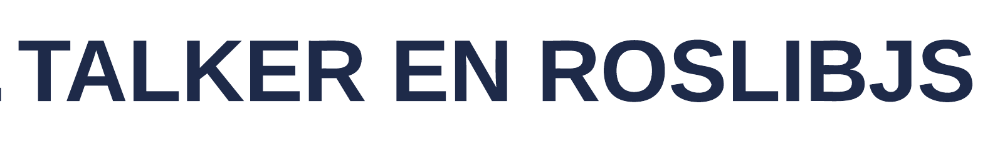
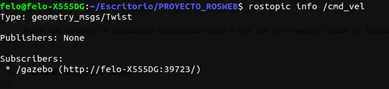
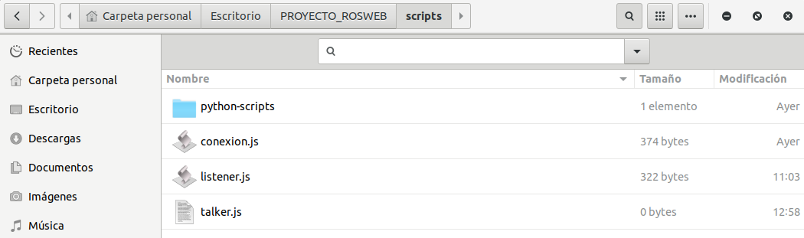
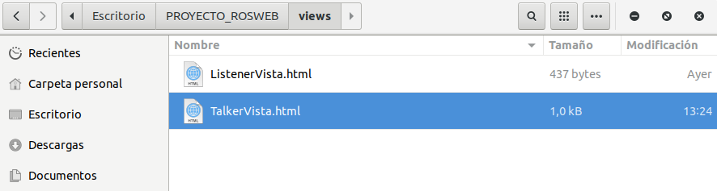
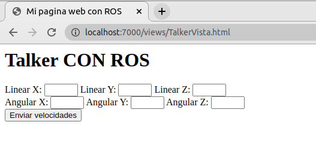
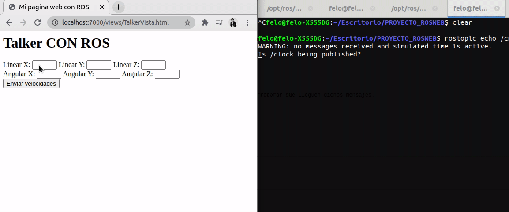

    

# INTRODUCCIÓN
En el siguiente tema realizaremos un talker en roslibjs para poder enviar mensajes a nuestro ros desde nuestro sitio web. Para ello nos vamos a basar en el topico de "/cmd_vel", enviado velocidades de diferentes magnitudes y mostrandolas en nuestro ros por medio de rostopic echo.

# REQUISITOS PREVIOS
 - [ ] Tener inicializando nuestro rosbridge server
 - [ ] Tener inicializada nuestra pagina con SimpleHttpServer

# MENÚ
 - [**Desplegando talker**](#desplegando-el-talker)
 - [**Creando el script talker**](#creando-el-script-talker)
 - [**Creando vista para el talker**](#creando-la-vista-para-el-talker)
 - [**Probando el script**](#probando-el-script)

# Desplegando el talker
En esta oportunidad vamos a desplegar el topico "cmd_vel" por medio del TurtleBot3, para ello vamos a ejecutar la simulación en Gazebo con el siguiente comando:
    
    roslaunch turtlebot3_gazebo turtlebot3_world.launch

Ahora que tenemos la simulación desplegada vamos a ver que información recibe el topico de "cmd_vel", lo haremos con el siguiente comando: 

    rostopic info /cmd_vel

    
    
Imagen 1. Información del topico cmd_vel

Sabemos que recibe un mensaje tipo geometry_msgs/Twist, así que ahora procederemos a crear nuestro script en roslibjs para enviar un mensaje al ros.

# Creando el script talker
A continuación crearemos un nuevo script en nuestra carpeta de scripts, lo llamaremos talker.js

    
    
Imagen 2. Creando archivo talker.js

Una vez creado nuestro archivo vamos a proceder a editarlo, agregaremos la siguiente función al codigo:

    function enviarVelocidad(){
        var cmdVel = new ROSLIB.Topic({
            ros : ros,
            name : '/cmd_vel',
            messageType : 'geometry_msgs/Twist'
        })

        var twist = new ROSLIB.Message({
            linear : {
                x : parseFloat(document.getElementById("lx").value),
                y : parseFloat(document.getElementById("ly").value),
                z : parseFloat(document.getElementById("lz").value)
            },
            angular : {
                x : parseFloat(document.getElementById("ax").value),
                y : parseFloat(document.getElementById("ay").value),
                z : parseFloat(document.getElementById("az").value)
            }
        })
        cmdVel.publish(twist)
    }
    
Explicaremos un poco que hace el código:

    var cmdVel = new ROSLIB.Topic({
            ros : ros,
            name : '/cmd_vel',
            messageType : 'geometry_msgs/Twist'
    })
    
En este código estamos haciendo la referencia hacia donde irá el mensaje y el tipo de mensaje que enviaremos.

    var twist = new ROSLIB.Message({
        linear : {
            x : parseFloat(document.getElementById("lx").value),
            y : parseFloat(document.getElementById("ly").value),
            z : parseFloat(document.getElementById("lz").value)
        },
        angular : {
            x : parseFloat(document.getElementById("ax").value),
            y : parseFloat(document.getElementById("ay").value),
            z : parseFloat(document.getElementById("az").value)
        }
    })

La variable twist almacena el mensaje que enviaremos hacia nuestro ROS, allí tenemos los valores que tomaremos directamente de las vista usando el función getElementById y almacenandolo en cada una de las variables tanto lineales como angulares.

    cmdVel.publish(twist)

Finalmente vamos a publicar el mensaje con la función publish.

# Creando la vista para el talker
Ahora creamos una pequeña vista en nuestra carpeta views en donde podremos insertar las velociades y enviarlas mediante un botón:

    
    
Imagen 2. Creando vista para el talker

el código nos queda algo así:

    <html>
        <head>
            <meta charset="UTF-8"/>
            <title>Mi pagina web con ROS</title>
            
            
            
        </head>

        <body>
            <h1>Talker CON ROS</h1>

            Linear X: 
            <input type="number" id="lx"  min="-1" max="1">

            Linear Y: 
            <input type="number" id="ly"  min="-1" max="1">

            Linear Z: 
            <input type="number" id="lz"  min="-1" max="1">
             
            Angular X: 
            <input type="number" id="ax"  min="-1" max="1">

            Angular Y: 
            <input type="number" id="ay"  min="-1" max="1">

            Angular Z: 
            <input type="number" id="az"  min="-1" max="1">
             
            <button onclick="enviarVelocidad()">Enviar velocidades</button>
        </body>

    </html>

# Probando el script

Una vez que tenemos nuestra vista, vamos a testear todo nuestro código. Primeramente vamos a ejecutar un comando en la consola que nos permita ver los mensajes que lleguen al cmd_vel, para ello ejecutamos el comando:

    rostopic echo /cmd_vel
    
Una vez que estamos haciendo echo a nuestro topico al que vamos a enviar un mensaje, lo siguiente será ir a la pagina que hemos creado:

    
    
Imagen 3. Vista del talker.

Finalmente, vamos a enviar algunos mensajes y vamos a ver la consola para corroborar que lleguen dichos mensajes.

    
    
Imagen 3. Enviando información a cmd_vel .

