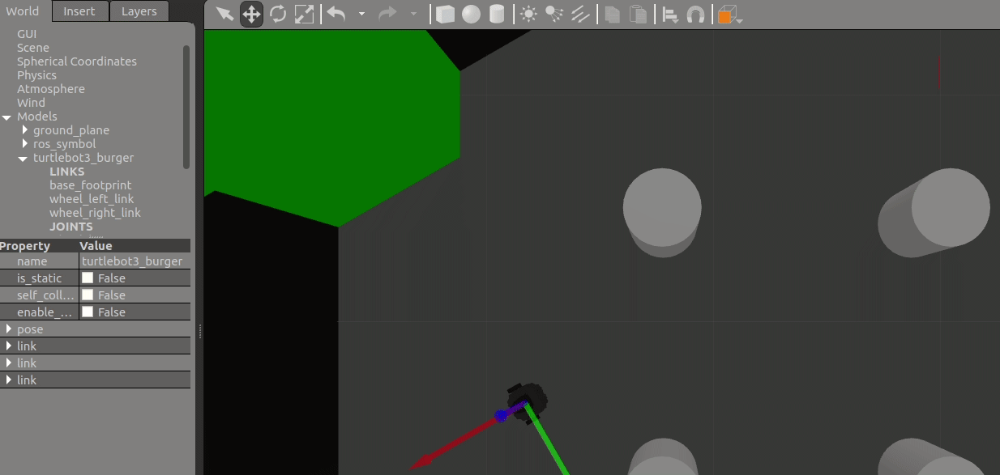
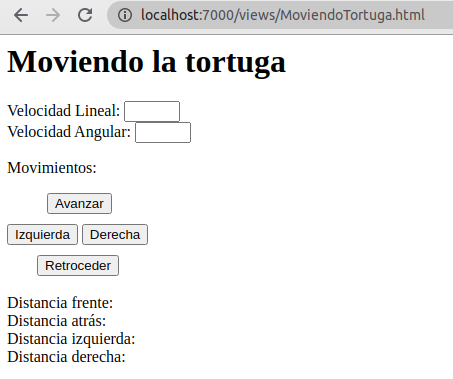

    

# INTRODUCCIÓN
Finalmente vamos a realizar un proyecto con todo lo que hemos aprendido hasta hoy. Moveremos el turtlebot (o cualquier robot que tenga un topico cmd_vel) simulandolo desde el gazebo y moviendolo desde nuestra pagina web, además vamos a obtener la distancias del frente, atras, derecha e izquierda del robot. El resultado final debería ser este:

    
    
Imagen 1. Demostración del proyecto

# REQUISITOS PREVIOS
 - [] Tener inicializando nuestro rosbridge server
 - [] Tener inicializada nuestra pagina con SimpleHttpServer
 - [] Tener instalado el TurttleBot3 o similar que permite el envio de mensajes a cmd_vel

# MENÚ
 - [**Creando la vista principal**](#creando-la-vista-principal)
 - [**Creando nuestro script**](#creando-nuestro-script)
 - [**Creando nuestro script**](#probando-nuestro-codigo)

# Creando la vista principal
Lo primero que haremos será crear la vista principal que nos permitirá mover mediante unos botones al robot, para ello vamos a nuestra carpeta views y creamos la vista llamada MoviendoTortuga.html una vez allí insertaremos el siguiente codigo:

    <html>

        <head>
            <meta charset="UTF-8"/>
            <title>Mi pagina web con ROS</title>
            
            
            
        </head>

        <body>
            <h1>Moviendo la tortuga</h1>

            Velocidad Lineal: 
            <input type="number" id="velocidadL"  min="-1" max="1"> 
            Velocidad Angular: 
            <input type="number" id="velocidadA"  min="-1" max="1">
             

            
Movimientos:

            

                <button onclick="moverAdelante()" style="margin: 0px 0 0 40px;">Avanzar</button> 
                <button onclick="moverIzquierda()" style="margin: 10px 0 0 0px;">Izquierda</button>
                <button onclick="moverDerecha()">Derecha</button> 
                <button onclick="moverAtras()" style="margin: 10px 0 0 30px;">Retroceder</button>
            

             
            

                Distancia frente:  
                Distancia atrás:  
                Distancia izquierda:  
                Distancia derecha:  
            

        </body>

    </html>

En el codigo simplemente estamos agregando los controles de velocidades, dirección y finalmente las distancias que mostraremos del turtlebot.

    
    
Imagen 3. Pagina MovimientoTortuga.html

# Creando nuestro Script 
Ahora iremos a nuestra carpeta de scripts y allí crearemos nuestro script para mover la tortuga llamado movimiendoTortuga.js. Ahora insertamos el siguiente código:

    function enviarVelocidad(pe, pz){

        var cmdVel = new ROSLIB.Topic({
            ros : ros,
            name : '/cmd_vel',
            messageType : 'geometry_msgs/Twist'
    })

    var twist = new ROSLIB.Message({
            linear : {
                x : pe,
                y : 0.0,
                z : 0.0
            },
            angular : {
                x : 0.0,
                y : 0.0,
                z : pz
            }
        })
        cmdVel.publish(twist)
    }

    //Funciones para avanzar y retroceder

    function moverAdelante(){
    var velocidadL = parseFloat(document.getElementById("velocidadL").value);
    enviarVelocidad(velocidadL, 0);
    }

    function moverAtras(){
    var velocidadL = parseFloat(document.getElementById("velocidadL").value);
    enviarVelocidad(-velocidadL, 0);
    }

    function moverIzquierda(){
    var velocidadL = parseFloat(document.getElementById("velocidadL").value);
    var velocidadA = parseFloat(document.getElementById("velocidadA").value);
    enviarVelocidad(velocidadL, velocidadA);
    }

    function moverDerecha(){
    var velocidadL = parseFloat(document.getElementById("velocidadL").value);
    var velocidadA = parseFloat(document.getElementById("velocidadA").value);
    enviarVelocidad(velocidadL, -velocidadA);
    }

    //Aquí creamos el listener que nos ayudará a obtener las distancias

    var listener = new ROSLIB.Topic({
    ros : ros,
    name : '/scan',
    messageType : 'sensor_msgs/LaserScan'
    });

    listener.subscribe(function(message) {
    var elem = document.getElementById('df');
    elem.innerHTML = "Distancia frente: " + message.ranges[1];
    var elem = document.getElementById('db');
    elem.innerHTML = "Distancia atrás: " + message.ranges[180];
    var elem = document.getElementById('dr');
    elem.innerHTML = "Distancia derecha: " + message.ranges[270];
    var elem = document.getElementById('dl');
    elem.innerHTML = "Distancia izquierda: " + message.ranges[90];
    });

Como hemos aprendido en los anteriores tutoriales, aquí simplemente estamos combinando la tecnica de un talker más un listener, el talker mandará las velocidades mientras que el listener escuchará los mensajes que lleguen del LaserScan para ver las distancias que existen entre los puntos cardinales del robot.
 
Con estás modificaciones, finalmente hemos creado nuestras vistas y script para poder mover la tortuga (o cualquier robot). 

# Probando nuestro codigo
Finalmente vamos a probar que todo funcione correctamente, para ello vamos a lanzar el turttlebot3 en el gazebo con el siguiente comando: 

    roslaunch turtlebot3_gazebo turtlebot3_world.launch
    
Cuando inicie el gazebo, podemos acceder a nuestra pagina web a la vista que hemos creado anteriormente. Deberiamos poder darle las velocidades y finalmente moverlo con los botones que hemos creado.

    
    
Imagen 3. Demostración del proyecto

En la imagen anterior podemos observar como movemos el robot, además le damos unas velocidades.
