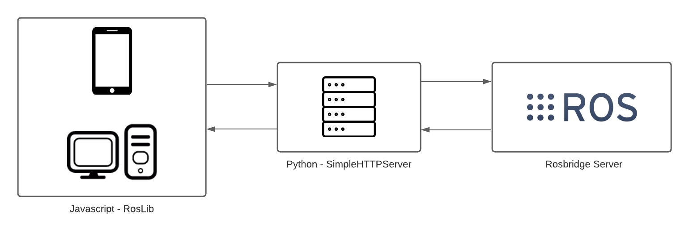

    

# **INTRODUCCIÓN**

El repositorio se crea para orientar a un usuario sobre el uso de la comunicación entre ROS y una pagina web. Contamos con una secuencia de carpetas en las cuales se explicará paso a paso desde la instalación hasta como comunicar ROS a través de **rosbridge** y la libreria de Javascript **roslibjs**. Además se cuenta con carpetas sobre preguntas frecuentes y conceptos basicos de la ingeniería que conlleva crear una pagina web, esto con el fin de solucionar la mayor serie de dudas al lector.

# **OBJETIVO GENERAL**

Desarrollar un instructivo de orientación para la implementación de una página web cuya funcionalidad es una comunicación con ROS utilizando **Rosbridge Server** como servidor de comunicaciones y la librería Roslibjs como cliente web.

# **ARQUITECTURA**

La arquitectura se basa en Cliente - Servidor, el siguiente esquema muestra la como se da la transmisión de mensajes por protocolos HTTP:

    

# **REQUISITOS**
 - Tener instalado una versión de ROS compatible con Rosbridge Server, en este tutorial usaremos **Ros Melodic**
 - Contar con una versión de Python 2.7 o superior.

# **CREDITOS**
 - Internet por permitir el libre apredizaje
 - Luis Felipe Londoño Medina (recopilador de información y creador de scripts)
 - Cesar David Salamanca (recopilador de información y creador de scripts)
 - Para ver todos los creditos del correspondiente repositorio, visitar la carpeta CREDITOS
